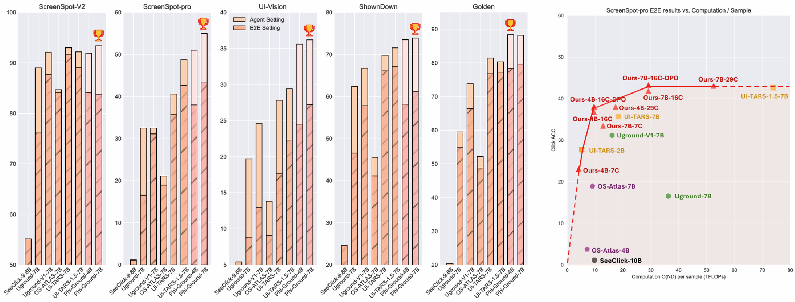

# Phi-Ground

<p align="center">
   <a href="https://microsoft.github.io/Phi-Ground/" target="_blank">🤖 HomePage</a> | <a href="https://huggingface.co/papers/2507.23779" target="_blank">📄 Paper </a> | <a href="https://arxiv.org/abs/2507.23779" target="_blank">📄 Arxiv </a> |<a href="https://huggingface.co/microsoft/Phi-Ground" target="_blank"> 😊 Model </a> | <a href="benchmark/new_annotations" target="_blank"> 😊 Eval data </a> 
</p>

Home page for Microsoft Phi-Ground series tech-report.





## Paper Abstract

With the development of multimodal reasoning models, Computer Use Agents (CUAs), akin to Jarvis
 from "Iron Man", are becoming a reality. GUI grounding is a core component for CUAs to execute
 actual actions, similar to mechanical control in robotics, and it directly leads to the success or failure
 of the system. It determines actions such as clicking and typing, as well as related parameters like the
 coordinates for clicks. Current end-to-end grounding models still achieve less than 65% accuracy on
 challenging benchmarks like ScreenSpot-pro and UI-Vision, indicating they are far from being ready
 for deployment. In this work, we conduct an empirical study on the training of grounding models,
 examining details from data collection to model training. Ultimately, we developed the Phi-Ground
 model family, which achieves state-of-the-art performance across all five grounding benchmarks for
 models under 10B parameters in agent settings. In the end-to-end model setting, our model still
 achieves SOTA results with scores of 43.2 on ScreenSpot-pro and 27.2 on UI-Vision. We believe
 that the various details discussed in this paper, along with our successes and failures, not only clarify
 the construction of grounding models but also benefit other perception tasks. 


## News 


- 🔥 New paper coming soon, with new model, dataset, benchmark!
- 🔥 Phi-Ground reached #2 Paper of the day in huggingface [daily papers](https://huggingface.co/papers/2507.23779)


## Release Plans

- [x] [Phi-Ground-4B-7C](https://huggingface.co/microsoft/Phi-Ground)
- [x] Evaluation code for benchmarks
- [x] [GPT-4O & O4-mini's planning data for evaluation](benchmark/new_annotations)
- [x] [CUActSpot benchmark & code](benchmark/CUActSpot)
- [x] [Phi-Ground-Any model](https://huggingface.co/microsoft/Phi-Ground-Any)
- [x] [Training data of Phi-Ground-Any model](https://huggingface.co/datasets/Miaosen/Grounding-Anything-GUI) 
- [ ] [Phi-Ground-Any paper]()

Please stay tuned!

## How to use

### Usage
The current `transformers` version can be verified with: `pip list | grep transformers`.

Examples of required packages:
```
flash_attn==2.5.8
numpy==1.24.4
Pillow==10.3.0
Requests==2.31.0
torch==2.3.0
torchvision==0.18.0
transformers==4.43.0
accelerate==0.30.0
```


### Input Formats

The model require strict input format including fixed image resolution, instruction-first order and system prompt.

Input preprocessing

```python
from PIL import Image
def process_image(img):

    target_width, target_height = 336 * 3, 336 *2
 
    img_ratio = img.width / img.height  
    target_ratio = target_width / target_height
   
    if img_ratio > target_ratio:  
        new_width = target_width  
        new_height = int(new_width / img_ratio)
    else:  
        new_height = target_height
        new_width = int(new_height * img_ratio)  
    reshape_ratio = new_width / img.width

    img = img.resize((new_width, new_height), Image.LANCZOS)  
    new_img = Image.new("RGB", (target_width, target_height), (255, 255, 255))  
    paste_position = (0, 0)  
    new_img.paste(img, paste_position)
    return new_img

instruction = "<your instruction>"
prompt = """<|user|>
The description of the element: 
{RE}

Locate the above described element in the image. The output should be bounding box using relative coordinates multiplying 1000.
<|image_1|>
<|end|>
<|assistant|>""".format(RE=instriuction)

image_path = "<your image path>"
image = process_image(Image.open(image_path))
```


Then you can use huggingface model or [vllm](https://github.com/vllm-project/vllm) to inference. We also provide [End-to-end examples](examples/call_example.py) and [benchmark results reproduction](benchmark/test_sspro.sh).


## Citation
```
@article{zhang2025phi,
  title={Phi-Ground Tech Report: Advancing Perception in GUI Grounding},
  author={Zhang, Miaosen and Xu, Ziqiang and Zhu, Jialiang and Dai, Qi and Qiu, Kai and Yang, Yifan and Luo, Chong and Chen, Tianyi and Wagle, Justin and Franklin, Tim and others},
  journal={arXiv preprint arXiv:2507.23779},
  year={2025}
}
```


## Contributing

This project welcomes contributions and suggestions.  Most contributions require you to agree to a
Contributor License Agreement (CLA) declaring that you have the right to, and actually do, grant us
the rights to use your contribution. For details, visit [Contributor License Agreements](https://cla.opensource.microsoft.com).

When you submit a pull request, a CLA bot will automatically determine whether you need to provide
a CLA and decorate the PR appropriately (e.g., status check, comment). Simply follow the instructions
provided by the bot. You will only need to do this once across all repos using our CLA.

This project has adopted the [Microsoft Open Source Code of Conduct](https://opensource.microsoft.com/codeofconduct/).
For more information see the [Code of Conduct FAQ](https://opensource.microsoft.com/codeofconduct/faq/) or
contact [opencode@microsoft.com](mailto:opencode@microsoft.com) with any additional questions or comments.

## Trademarks

This project may contain trademarks or logos for projects, products, or services. Authorized use of Microsoft
trademarks or logos is subject to and must follow
[Microsoft's Trademark & Brand Guidelines](https://www.microsoft.com/legal/intellectualproperty/trademarks/usage/general).
Use of Microsoft trademarks or logos in modified versions of this project must not cause confusion or imply Microsoft sponsorship.
Any use of third-party trademarks or logos are subject to those third-party's policies.
